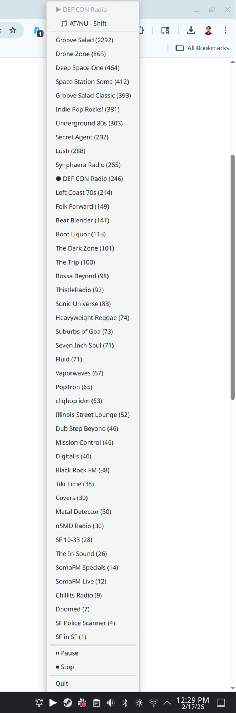

# SomaFM Linux

A native Linux system tray application for streaming [SomaFM](https://somafm.com) internet radio channels.

This is a Linux port of the [macOS SomaFM Miniplayer](https://github.com/fuziontech/SomaFM).

## Quick Install

```bash
curl -sSL https://raw.githubusercontent.com/fuziontech/SomaFM_Linux/main/install.sh | bash
```

This will install system dependencies, clone the repo to `~/.local/share/somafm/`, create a systemd user service, and start the app. Works on Fedora, Ubuntu/Debian, Arch, and openSUSE (plus derivatives).

To manage the service afterwards:

```bash
systemctl --user start somafm    # start
systemctl --user stop somafm     # stop
systemctl --user status somafm   # check status
```

To uninstall:

```bash
systemctl --user disable --now somafm
rm -rf ~/.local/share/somafm ~/.config/systemd/user/somafm.service
```

## Screenshot



## Features

- System tray integration with AppIndicator
- Browse all SomaFM channels sorted by listener count
- Now playing display with current song info
- Search current song on YouTube or Spotify
- Channel caching for offline resilience
- Lightweight - uses mpv for audio streaming

## Requirements

### System Dependencies

```bash
# Fedora/RHEL
sudo dnf install mpv python3-gobject gtk3 libappindicator-gtk3

# Ubuntu/Debian
sudo apt install mpv python3-gi gir1.2-appindicator3-0.1 gir1.2-gtk-3.0

# Arch
sudo pacman -S mpv python-gobject gtk3 libappindicator-gtk3
```

### Python Dependencies

```bash
# Using uv (recommended)
uv venv --system-site-packages
uv sync

# Or using pip
pip install -r requirements.txt
```

## Usage

```bash
./somafm.py
```

Or:

```bash
python3 somafm.py
```

### Controls

- **Right-click** the tray icon to open the channel menu
- **Middle-click** to toggle play/pause
- Click on the current song to search it on YouTube or Spotify

## Project Structure

```
├── somafm.py           # Main application, tray icon setup
├── audio_player.py     # mpv wrapper with IPC control
├── channel_manager.py  # Fetch/cache channels from SomaFM API
├── models.py           # Channel data model
├── pyproject.toml      # Project metadata and dependencies (uv/pip)
└── requirements.txt    # Python dependencies (pip)
```

## API Endpoints

- **Channels:** `https://api.somafm.com/channels.json`
- **Current Song:** `https://api.somafm.com/songs/{channelId}.json`

## License

MIT

## Credits

- [SomaFM](https://somafm.com) - Commercial-free internet radio
- Original macOS app by [Drop Tables Software, LLC](https://github.com/fuziontech/SomaFM)
